# From data to functa: Your data point is a function and you should treat it like one

This README contains figures for the above paper.

## Figure 4
Meta-learned initialization + 4 gradient steps and target for test scene.
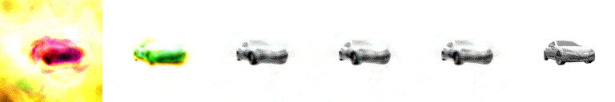

## Figure 7
Course of optimization for imputation of voxel from partial observation.

### From back
Partial observation    |  Imputation
:---------------------:|:---------------------:
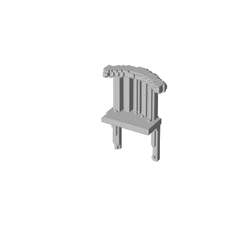  |  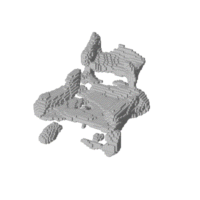

### From front
Partial observation    |  Imputation
:---------------------:|:---------------------:
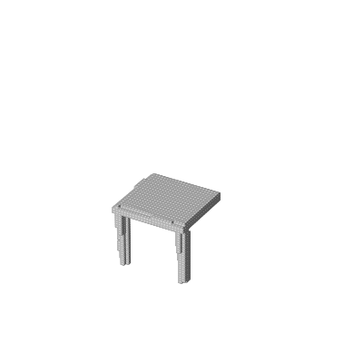  |  

### From left
Partial observation    |  Imputation
:---------------------:|:---------------------:
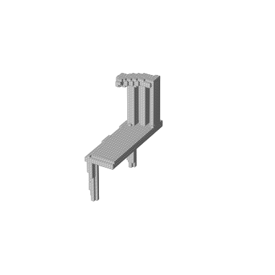  |  

### From lidar scan
Partial observation    |  Imputation
:---------------------:|:---------------------:
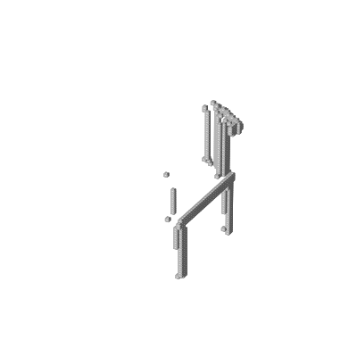  |  

## Figure 9
Uncurated samples from DDPM (diffusion) trained on 64-dim modulations of SRN-cars.

## Figure 10
Latent interpolation between two car scenes with moving pose.

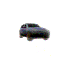

## Figure 11
Novel view synthesis from occluded view.
Occluded view        |  Ground truth       |Inferred             | No prior
:-------------------:|:-------------------:|:-------------------:|:-------------------:
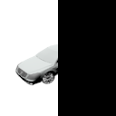 | 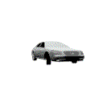 | 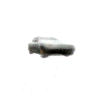| 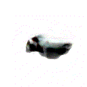

## Figure 12
Uncurated samples from flow trained on 256-dim modulations on ERA-5 temperature data.

## Figure 26
Additional voxel imputation results.
Partial observation    |  Imputation
:---------------------:|:---------------------:
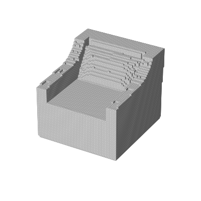  |  
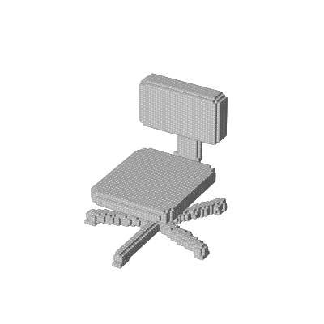  |  
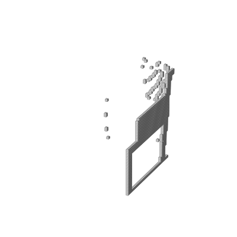  |  
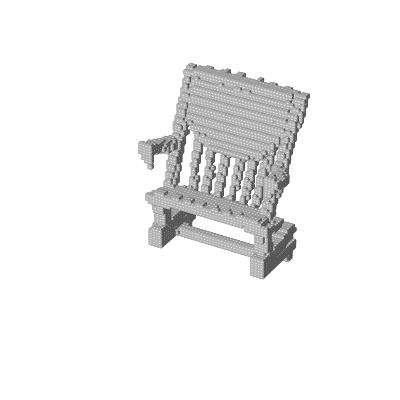  |  

## Figure 27
Additional novel view synthesis results.
Occluded view        |  Ground truth       |Inferred             | No prior
:-------------------:|:-------------------:|:-------------------:|:-------------------:
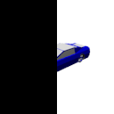 | 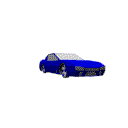 | 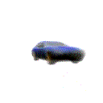| 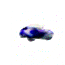
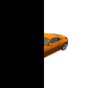 | 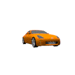 | 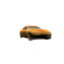| 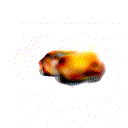
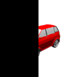 | 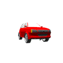 | 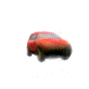| 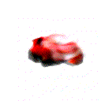
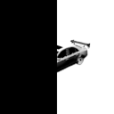 | 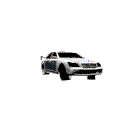 | 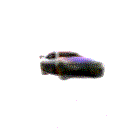| 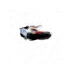

